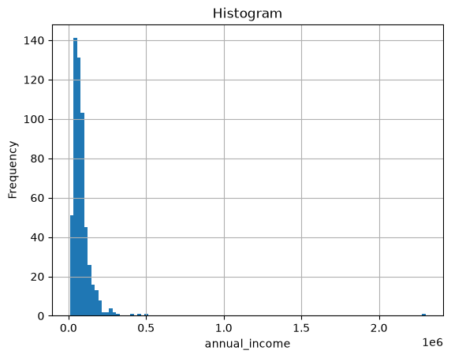
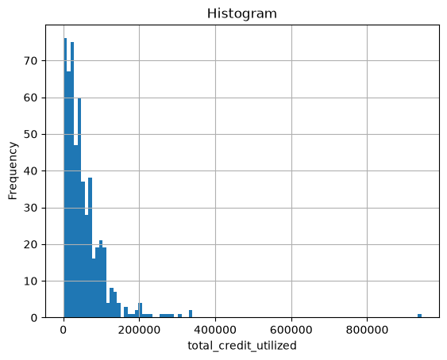
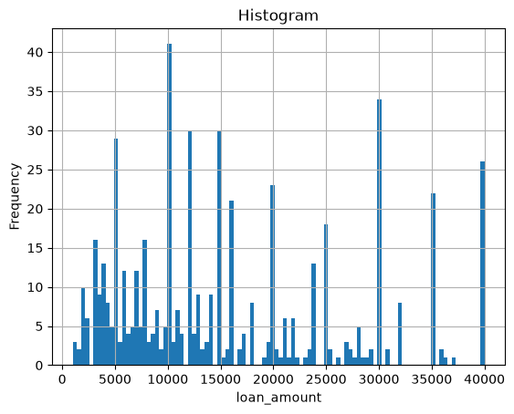
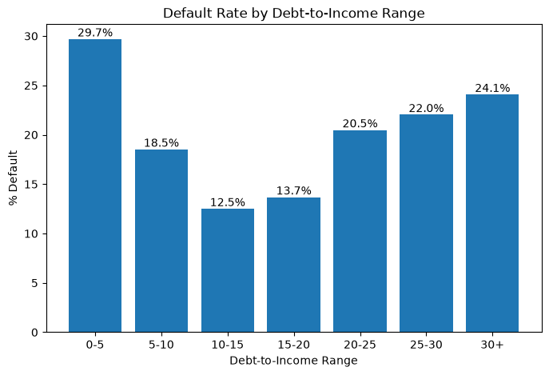
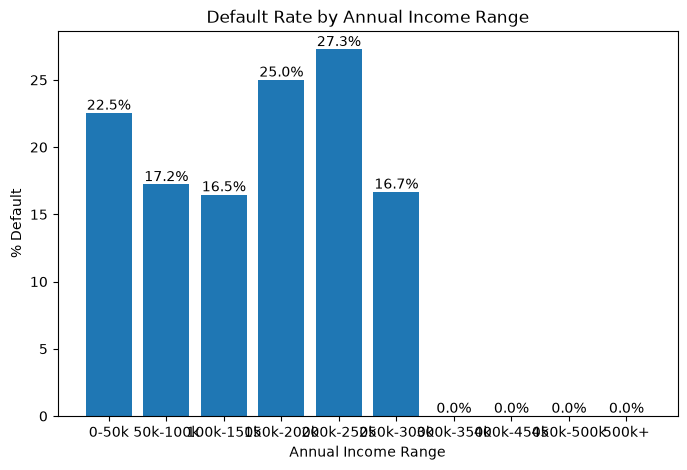
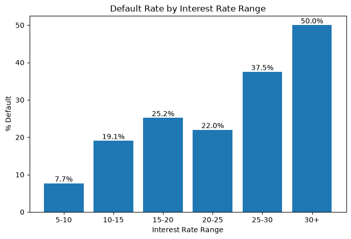
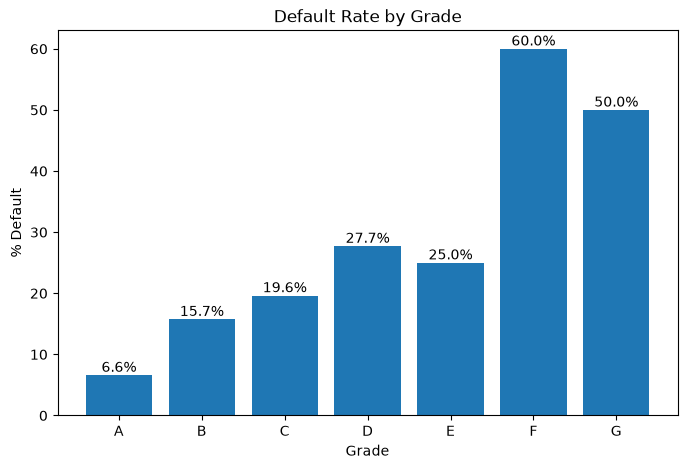
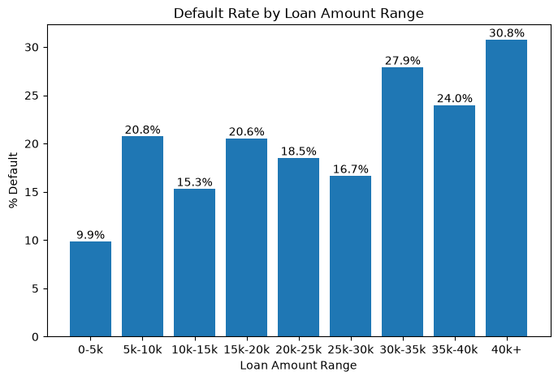
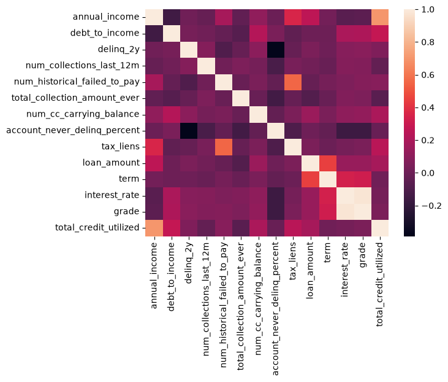

# Credit-Risk-Analysis-Probability-of-Default-from-Lending-Club-Loan-Dataset
## Project Workflow

## Project Overview
This project aims to predict customer default risk and identify the key drivers behind loan defaults.
## Dataset 
* annual_income(num)(independent variable)
* debt_to_income(num)(independent variable)
* delinq_2y(num)(independent variable)
* num_collections_last_12m(num)(independent variable)
* num_historical_failed_to_pay(num)(independent variable)
* total_collection_amount_ever (num)(independent variable)
* num_cc_carrying_balance(num)(independent variable)
* account_never_delinq_percent(num)(independent variable)
* tax_liens(num)(independent variable)
* loan_amount(num)(independent variable)
* term(ordinal catagorical)(independent variable)
* interest_rate(num)(independent variable)
* grade(ordinal catagorical)(independent variable)
* total_credit_utilized(num)(independent variable)
* loan_status(target variable)
## Exploratory Data Analysis
### Distribution analysis
#### Annual Income

#### Total Credit Utilized

#### Loan Amount

#### Finding from distribution analysis
Most people annual income in range between 50k-100k(49%).From the histrogram graph of annual_income, loan_amount and total_creit_utilized we found that we need to take a log transformation to annual_income and total_creit_utilized because of right-skewness of both histrogram graph before we bring a dataset to fit a logistic regression model.( Decreasing an effect feom outlier)
### Default Rate Analysis
#### Debt to Income

#### Annual Income

#### Interest Rate

#### Grade

#### Loan Amount

#### Finding from Default Rate Analysis
We found a strong correlation from two variables there are interest rate and grade with loan default.At higher range of interest rate and grade found more rate of default. We also found some relation in loan amount at the first and in the end related with default rate although between thease two point are un predictable. The interesting that we found from default rate analysis come from two variables there are debt to income and annual income which have very similar trend between them.More clarify, at the low range of both variables found high rate of default and slightly decrease at the middle range before slightly increase at the high range of variables(Inverted Bell Curve). However we can't find data evidence to support that both of them are actually bell curve.
### Correlation Analysis

#### Finding from correlation analysis
When we considering a result from correlation heat map found that interest_rate and grade have a high correlation between each of them and also has a high value of variance inflation factor so, we consider to choose one of them out. Interest rate is continuous meanwhile, grade is ordinal catagorical, I prefer to keep an interest rate.
